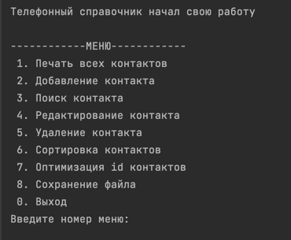
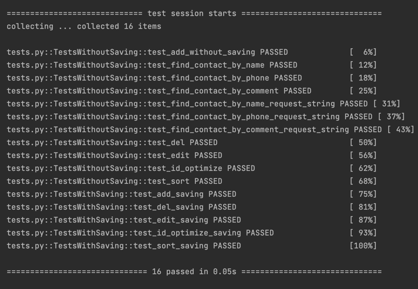

# OTUS Python Dev Course
## HW #2
### Рефакторинг ДЗ из первого модуля (телефонного справочника)
#### Цель:
Провести рефакторинг ДЗ из первого модуля

### Ход работы:

1. Созданы классы:
    * Contact - для хранения данных контакта
    * PhoneBook - для хранения методов работы со списков контактов и файлом
    * Interface - для хранения методов работы с консолью

### Запуск программы:
Для запуска телефонного справочника необходимо сделать:
1. Клонировать проект командой   `git clone https://github.com/koppeltatyana/OTUS_python_dev.git`
2. Открыть проект в PyCharm, установить виртуальное окружение. Для установки зависимостей необходимо выполнить команду:  `pip install -r requirements.txt`
3. Кликнуть по файлу HW2/main.py ПКМ и нажать на кнопку "Run", в консоли PyCharm будет выведено меню.

** Для запуска автотестов необходимо кликнуть по файлу HW2/tests/tests.py ПКМ и нажать на кнопку "Run". В консоли будет результат выполнения тестов

